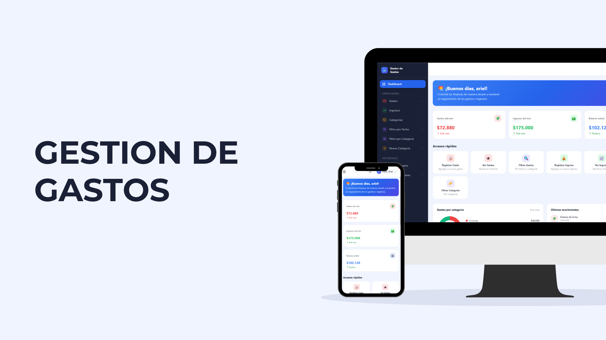
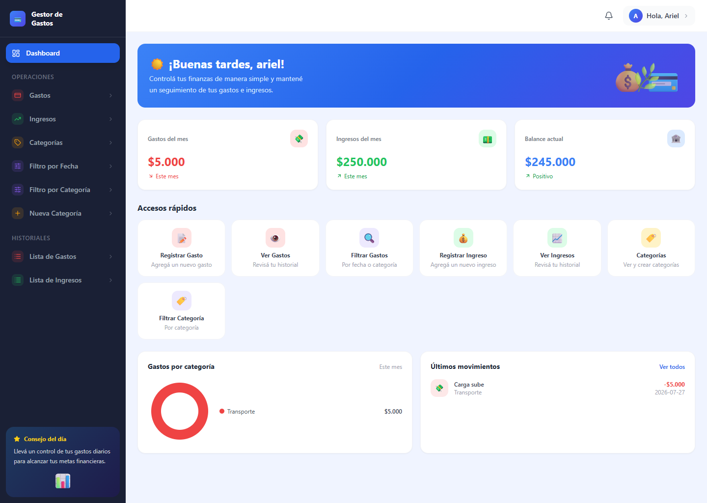
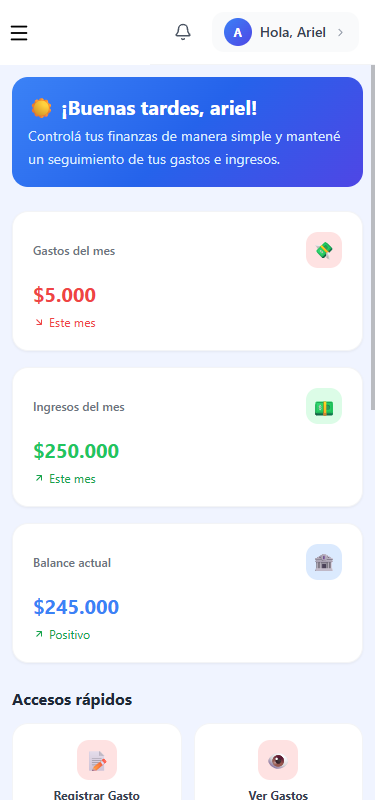

# Sistema de Gestión de Gastos Personales

## Tabla de contenidos

- [Descripción del proyecto](#-descripción)
- [Objetivos](#-objetivos)
- [Funcionalidades](#-funcionalidades)
- [Capturas de pantalla](#-capturas-de-pantalla)
- [Tecnologías utilizadas](#-tecnologías-utilizadas)
- [Uso de la aplicación](#-uso-de-la-aplicación)
- [Documentación técnica](#-documentación-técnica)
  - [Arquitectura del sistema](#arquitectura-del-sistema)
  - [Diagramas](#diagramas)
- [Equipo de desarrollo](#-equipo-de-desarrollo)
- [Mejoras futuras](#-mejoras-futuras)
- [Licencia](#-licencia)

## 📋 Descripción

Sistema web desarrollado para ayudar a las personas a administrar sus finanzas personales de forma sencilla e intuitiva. La aplicación permite registrar ingresos y gastos, organizarlos mediante categorías y visualizar reportes y estadísticas que facilitan el análisis de la situación financiera.

El sistema busca reemplazar el uso de planillas o anotaciones manuales, centralizando toda la información financiera en una única plataforma accesible desde cualquier dispositivo.

## 🎯 Objetivos

- Facilitar el control de las finanzas personales.
- Centralizar la información financiera del usuario.
- Permitir el registro de ingresos y gastos de manera organizada.
- Mejorar la visualización de la información mediante reportes y estadísticas.
- Ayudar al usuario a identificar hábitos de consumo y optimizar la administración de su dinero.

## 🚀 Funcionalidades

### Autenticación de Usuarios

* Registro de usuarios.
* Inicio de sesión seguro.
* Gestión de perfiles.

### Gestión Financiera Personal

* Administración de ingresos y gastos.
* Organización de información financiera.

### Gestión de Movimientos

* Registro de ingresos.
* Registro de gastos.
* Edición y eliminación de movimientos.
* Historial completo de operaciones.

### Categorías

* Creación de categorías personalizadas.
* Clasificación de ingresos y gastos para facilitar el análisis.

### Reportes y Estadísticas

* Balance general.
* Ingresos totales.
* Gastos totales.
* Distribución de gastos por categoría.
* Filtrado por fechas.
* Dashboard con información relevante y estadísticas.

## 📸 Capturas de Pantalla

## 🏗 Tecnologías utilizadas

La aplicación está construida bajo una arquitectura cliente-servidor.

### Frontend

Responsable de la interfaz de usuario y la interacción con el sistema.

Tecnologías utilizadas:

* React
* TailwindCSS
* Axios
* React Router

### Backend

Responsable de la lógica de negocio y acceso a los datos.

Tecnologías utilizadas:

* Java 17
* Spring Boot
* Spring Data JPA
* Spring Security
* JWT
* Maven

### Base de Datos

* MySQL

### Contenedores

* Docker
* Docker Compose

## ▶ Uso de la Aplicación

Por el momento, solo contamos con un video demostrativo de la aplicación, el cual se encuentra disponible en el siguiente enlace:

[Video Demostrativo](https://youtu.be/UR1UAw2U6vk)

## 📚 Documentación técnica

### Arquitectura del sistema

La aplicación implementa una arquitectura Cliente-Servidor, donde:

- Frontend: responsable de la interfaz de usuario y la experiencia del usuario.
- Backend: encargado de la lógica de negocio, autenticación y acceso a la base de datos.
- Base de datos: almacena toda la información financiera del usuario.

### Diagramas

- [Diagrama de entidad-relación](https://github.com/ArielNicolas2021/Grupo6-DDS/blob/main/docs/gestion_gastos_der.png)
- [Diagrama de clases](https://example.com/class-diagram)
- [Diagrama de casos de uso](https://example.com/use-case-diagram)
- [Flujo de usuario](https://example.com/user-flow)

## 👥 Equipo de desarrollo

- Gabriel Benítez — Frontend Developer
- Ariel Aguilar — Backend Developer / Scrum Master
- Rocco Díaz — Backend Developer
- Micaela Cafardo — QA Tester

El proyecto fue desarrollado utilizando la metodología ágil Scrum, favoreciendo una evolución continua y organizada del producto.

## 🚀 Mejoras futuras

Entre las funcionalidades planificadas para futuras versiones se encuentran:

- Exportación de reportes a PDF y Excel.
- Gráficos y estadísticas avanzadas.
- Presupuestos mensuales.
- Objetivos de ahorro.
- Recordatorios de pagos y vencimientos.
- Notificaciones personalizadas.
- Aplicación móvil.
- Integración con bancos y billeteras virtuales.
- Análisis predictivo de gastos mediante inteligencia artificial.

## 📄 Licencia

Este proyecto fue desarrollado con fines académicos y de aprendizaje.

© 2026 - Sistema de Gestión de Gastos Personales. Todos los derechos reservados.